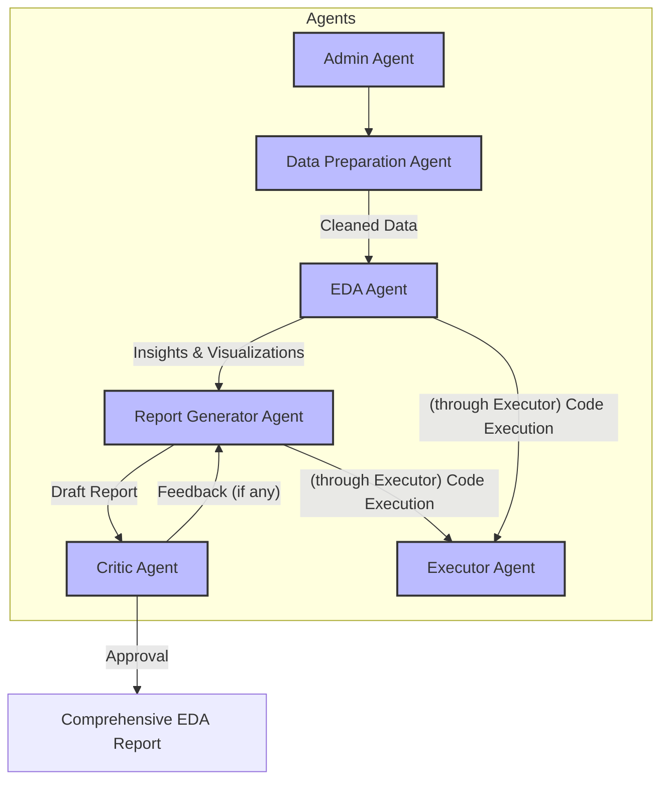

# Streamlining Exploratory Data Analysis (EDA) with a Multi-Agent System using Autogen

This project aims to streamline the Exploratory Data Analysis (EDA) process by leveraging a multi-agent system built with Microsoft Autogen. EDA is a crucial step in data science, but it can be repetitive and complex. This system automates and organizes EDA tasks, ensuring efficiency, reproducibility, and high-quality results in a collaborative setting.

## Problem Statement

Exploratory Data Analysis (EDA) involves understanding a dataset’s structure, characteristics, and insights. This project simplifies EDA by using a multi-agent system, where each agent specializes in a specific task, ensuring modularity and efficient workflow management.

## System Components

The system comprises the following specialized agents:

1.  **Admin Agent**: Oversees the entire workflow, ensures coordination among agents, and maintains alignment with project goals. It also handles human input for workflow initiation and termination.
2.  **Data Preparation Agent**: Responsible for data cleaning, preprocessing, and feature engineering. This includes handling missing values, encoding categorical variables, and scaling numerical features.
3.  **EDA Agent**: Performs statistical summarization, generates key insights, and creates visualizations from the cleaned data.
4.  **Report Generator Agent**: Compiles a comprehensive and well-structured EDA report based on the insights and visualizations provided by the EDA Agent. It is designed to incorporate feedback.
5.  **Critic Agent**: Reviews the outputs of other agents, particularly the EDA report, providing constructive feedback to improve clarity, accuracy, and actionability. It can request revisions.
6.  **Executor Agent**: Validates code generated by other agents and executes it in a defined working directory. It ensures the accuracy of results and handles the execution environment.

## Architecture and Workflow

The agents are interconnected in a collaborative group chat environment powered by Autogen. They communicate, coordinate tasks, and iteratively refine the analysis based on feedback.

**Workflow:**

1.  The **Admin Agent** initiates the EDA workflow by providing a dataset path.
2.  The **Data Preparation Agent** receives the dataset, cleans, preprocesses, and prepares it.
3.  The **EDA Agent** then takes the prepared data, performs statistical analysis, and generates insights and visualizations.
4.  The **Report Generator Agent** receives the insights and visualization code to draft the EDA report.
5.  The **Critic Agent** reviews the generated report, providing feedback to the Report Generator Agent for revisions.
6.  The **Executor Agent** is used by other agents (e.g., Data Preparation, EDA) to validate and execute code snippets, such as data loading, cleaning, or plotting.
7.  This iterative process continues until the Critic Agent is satisfied with the report, leading to a comprehensive final EDA report.



## Expected Deliverables

*   **Code Submission**: Python scripts implementing the multi-agent system using Autogen.
*   **EDA Report**: A comprehensive report including:
    *   An overview of the data.
    *   Key insights and findings.
    *   Detailed visualizations.
    *   A summary of conclusions, incorporating feedback from the Critic Agent.

## Setup and Installation

1.  Clone the repository:
    ```bash
    git clone <repository-url>
    cd EDA_Multi_Agent_System_Autogen
    ```
2.  Create a virtual environment (optional but recommended):
    ```bash
    python -m venv venv
    source venv/bin/activate  # On Windows: `venv\Scripts\activate`
    ```
3.  Install the required dependencies:
    ```bash
    pip install -r requirements.txt
    ```
4.  Set up your LLM configuration. Create a `OAI_CONFIG_LIST` file (JSON format) in the `EDA_Multi_Agent_System_Autogen` directory. This file should contain a list of dictionaries, where each dictionary specifies an LLM model and its API key. For example:
    ```json
    [
        {
            "model": "gpt-4",
            "api_key": "YOUR_OPENAI_API_KEY"
        },
        {
            "model": "gemini-1.5-flash-latest",
            "api_key": "YOUR_GEMINI_API_KEY"
        }
    ]
    ```
    You can include multiple models. The `gemini-1.5-flash-latest` model is also supported as specified in `eda_agents.py`.

## How to Run

To run the EDA multi-agent system, execute the `eda_agents.py` script:

```bash
python eda_agents.py
```

The script will create a dummy CSV file (`dummy_dataset.csv`) and then initiate the EDA workflow with this dataset. The agents will then interact to perform the EDA and generate a report.

## Future Improvements

*   Implement more sophisticated data preprocessing and feature engineering steps.
*   Expand the range of visualizations and statistical analyses performed by the EDA Agent.
*   Enhance the Critic Agent's ability to provide more granular and context-aware feedback.
*   Integrate with various data sources (databases, APIs, etc.) beyond local CSV files.
*   Develop a more robust reporting mechanism to export the EDA report in different formats (e.g., PDF, HTML). 